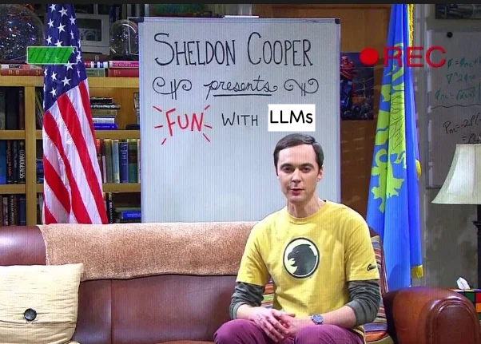
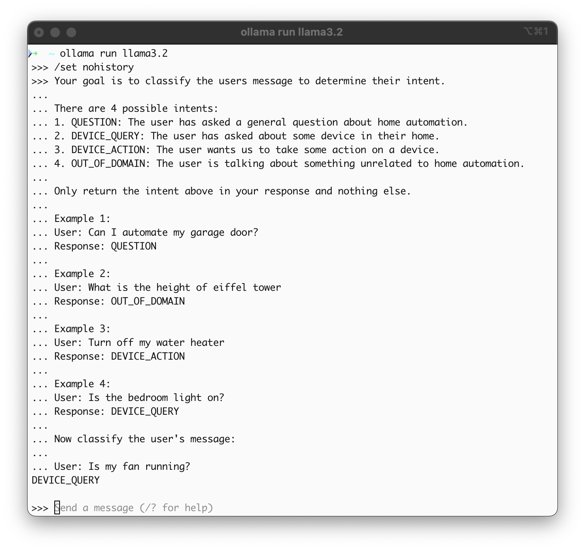

+++
title = 'Fun with LLMs - Intent detection'
date = 2024-11-10T12:14:20-08:00
+++



**Imagine this:** You're building some kind of a chat system. For every message from the user, you want to figure out what the message is about. Is the user asking a question? Or does the user asking to perform a specific action? Or is the user talking about something completely irrelevant to your system?

What we are doing here is detecting the "intent" of the user's message. Think of the intent as a set of predefined categories like `QUESTION`, `ACTION1`, `ACTION2`, `OUT_OF_DOMAIN`.

If you're vaguely familiar with machine learning, you would assume that this will involve training some kind of model using a bunch of examples of messages mapped to intents. And you've heard that training models from scratch is complicated, time-consuming and expensive.

As I understand it, this was quite accurate a few years ago. But now that we have access to powerful LLMs, there is a much simpler approach to achieve this type of intent detection. Like all good things in life, there is a caveat.

*(The reason this has been on my mind lately is because of a paper I just read by Amazon science. More on that towards the end of this post.)*

## Using LLMs for intent detection

How can you perform intent detection using LLMs? You politely ask it of course. You don't need any kind of pre-training. It's just that simple.

You could try this out yourself locally on your laptop! You can use [Ollama](https://ollama.com/) which is a great way to run LLMs locally.

**Pre-requisite:** Install [Ollama](https://ollama.com/).

Typically when we call LLMs, we don't directly pass in the input that we want it to process. We must first provide the LLM with some "context" about what we want it to do. Think of this as simple instructions in english for the LLM to follow. It can also contain a few examples to help the LLM understand better.

Each call to the LLM will contain the input that we want it to process **prefixed** with some background information.

Start Ollama:
```sh
# Download and run the model.
ollama run llama3.2
```

Then run this in the ollama prompt (since we will pass the entire context in every message we don't want Ollama to retain the conversation history.):
```
/set nohistory
```

Now paste in the following into the prompt and observe the output:

```
Your goal is to classify the users message to determine their intent.

There are 4 possible intents:
1. QUESTION: The user has asked a general question about home automation.
2. DEVICE_QUERY: The user has asked about some device in their home.
3. DEVICE_ACTION: The user wants us to take some action on a device.
4. OUT_OF_DOMAIN: The user is talking about something unrelated to home automation.

Only return the intent above in your response and nothing else.

Example 1:
User: Can I automate my garage door?
Response: QUESTION

Example 2:
User: What is the height of eiffel tower
Response: OUT_OF_DOMAIN

Example 3:
User: Turn off my water heater
Response: DEVICE_ACTION

Example 4:
User: Is the bedroom light on?
Response: DEVICE_QUERY

Now classify the user's message:

User: Is my fan running?
```

The LLM will return back something like `DEVICE_QUERY` *(Well at least that's what I got back when I ran locally. LLMs can be a little unpredictable 😅)*.



You can run this multiple times changing the last sentence to see how it behaves. Here's what I get:

| Last sentence of prompt    | Result        |
| -------------------------- | ------------- |
| Turn off my lights         | DEVICE_ACTION |
| How tall is mount everest? | OUT_OF_DOMAIN |


See how simple that is?

This approach isn't perfect. With the prompt above, I get incorrect results for `How many light bulbs can I automate?` (`DEVICE_QUERY` instead of `QUESTION`). With maybe a larger LLM model and a modified prompt we could get better results. But the general take-away here is that it is extremely simple to use LLMs for this type of simple intent detection tasks.

This is quite fun. You can spend hours wordsmithing the prompt and comparing the results. You could also try different models to see what performs better.

## Caveats?

A major drawback of this approach is that invoking an LLM especially a large one like Claude 3.5 Sonnet works out to be significantly slower than using a custom ML model specifically trained for intent detection.

So we're significantly simplifying our implementation (no need to gather lots of examples, no need to train a model) and getting great results, as LLMs excel at understanding language, but we get slower inference and higher cost.

## Related research

Here's the paper I read recently: [Intent detection in the age of LLMs, Amazon Science](https://www.amazon.science/publications/intent-detection-in-the-age-of-llms)

The current SOTA (State of the Art) for intent detection seems to be SetFit (fine-tuned sentence transformer models). There are some drawbacks for this: they especially don't perform well when it comes to detecting out-of-scope (OOS) queries. This is because the original dataset used for training comes from domain experts (not AI researchers) so it is unbalanced in terms of negative examples.

In the paper they compare using LLMs using ICL (in context learning) and COT (chain of thought) prompting for intent detection with the SetFit based method. The LLMs (at least the good ones) usually perform better than SetFit, but at the cost of latency. So they propose a middle ground, where first SetFit is used, and then if the confidence is low, it routes it to the LLM.

When it comes to detection of out-of-scope, previous studies had only looked at the effect of increasing the number of labels (intents to be classified), it had not looked at effect of scope of the labels. Wider scope means each label is representing a wider concept. So having labels with wider scope increases the chances that the LLM might end up classifying some out-of-scope query as in-scope and match it to one of the labels. Wider scope is simulated in the paper, by picking a bunch of sibling intents (the intents are organized in a hierarchy) and randomly combining them.

Interesting learnings:
- Performance of SetFit can be improved by 5% using augmentation of negative examples. But it still performs 8% worse than the best performing LLMs.
  > *"To help SetFit learn better decision boundaries, we augment training data by modifying keywords in sentences by (a) removing, or (b) replacing them with random strings. These modified sentences are considered OOS during training. Since these augmented OOS sentences have similar lexical pattern as in-scope training sentences, these are expected to help the model avoid latching onto any spurious patterns and help overall learning."*
- LLMs would have performed better, but their increased latency makes them not ideal for real-time applications at scale.
- Fine grained labels and smaller label spaces are better for LLMs' out-of-scope detection capabilities.
- In scope performance of LLM is relatively immune to change in scope, but drops off with increase in label space size. However, the degradation in out-of-scope detection is worse.
- SNA (SetFit + negative augmentation) shows degradation in in-scope accuracy with both increase in scope of the labels and number of labels.

Misc tricks:
- To prevent LLMs from using any spurious patterns from intent label names, especially for open source datasets, they randomly mask them to Label-xx, where xx is some random integer.